# Rapport de Projet de Fin d'Études

---

<!-- 
**Instructions pour l'étudiant:**
Ce document est une version lourdement détaillée de votre rapport, conçue pour atteindre une longueur substantielle (cible 38+ pages après formatage et ajout de visuels). Il suit la structure et les recommandations de M. Lahmer.
Les sections marquées avec [À COMPLÉTER] sont des placeholders où vous devez ajouter votre propre contenu.
-->

## Résumé / Abstract

Aujourd'hui, Internet a changé la façon dont les gens organisent et vivent leurs voyages. Beaucoup de sites permettent de réserver des hôtels ou des billets, mais peu proposent de vraiment partager ses expériences et de profiter des conseils d'autres voyageurs. C'est pour répondre à ce besoin que ce projet a été réalisé : créer une application web qui aide à planifier ses voyages et à partager ses souvenirs avec une communauté.
Le principal problème était de réunir, sur une seule plateforme, la planification de voyages (choix des destinations, gestion du budget, organisation des étapes) et le partage d'avis, de photos et de conseils entre utilisateurs. L'objectif était de rendre l'application facile à utiliser, sécurisée, et capable d'évoluer avec le temps.
Pour cela, j'ai développé une application avec des outils modernes (MongoDB, Express, React, Node.js). L'utilisateur peut créer son itinéraire, ajouter des lieux à visiter, gérer son budget, écrire des avis, poster des photos, et suivre d'autres voyageurs. Un espace d'administration permet aussi de gérer les comptes et de modérer les contenus.
Le résultat est une application simple, agréable à utiliser, et qui fonctionne bien. Elle permet de planifier un voyage de A à Z, de partager ses expériences, et de découvrir de nouveaux endroits grâce à la communauté. Ce projet montre qu'il est possible, même avec des moyens limités, de réaliser une plateforme complète et moderne, prête à être améliorée dans le futur.

---

## Liste des abréviations

| Abréviation | Signification |
| :--- | :--- |
| MERN | MongoDB, Express, React, Node.js |
| API | Application Programming Interface |
| JWT | JSON Web Token |
| BDD | Base de Données |
| SGBD | Système de Gestion de Base de Données |
| UI/UX | User Interface / User Experience |
| XSS | Cross-Site Scripting |
| CSRF | Cross-Site Request Forgery |
| DAL | Data Access Layer |
| CRUD | Create, Read, Update, Delete |
| HTTP | HyperText Transfer Protocol |
| REST | REpresentational State Transfer |
| ODM | Object-Document Mapper |

---

## Table des figures

*Cette liste sera générée automatiquement à partir des légendes de vos figures lors de la compilation finale du document.*

---

## Table des matières

*Cette table sera générée automatiquement à partir des titres de votre document lors de la compilation finale.*

---

## Introduction

L'avènement du numérique a profondément transformé l'industrie du tourisme. Les voyageurs modernes, hyper-connectés, recherchent des expériences de plus en plus personnalisées et authentiques. Cette tendance a favorisé l'émergence du "social travel", où le partage d'expériences et les recommandations communautaires jouent un rôle central dans la planification des voyages. Les plateformes traditionnelles, souvent axées sur la simple réservation, peinent parfois à intégrer cette dimension sociale de manière fluide et intuitive. C'est dans ce contexte que s'inscrit ce projet de fin d'études.

Ce projet vise à concevoir et développer une solution innovante : une application web complète de planification de voyages et de partage d'expériences. L'objectif est de créer un écosystème intégré où l'utilisateur peut passer de l'inspiration à la planification, puis au partage, sans quitter la plateforme.

Construite sur la stack MERN (MongoDB, Express, React, Node.js), une technologie moderne et performante, l'application offre une plateforme riche où les utilisateurs peuvent non seulement créer et gérer leurs itinéraires, mais aussi interagir avec une communauté de voyageurs. Ils peuvent publier des avis, partager des photos, suivre d'autres utilisateurs et découvrir de nouvelles destinations à travers les yeux de leurs pairs. Pour garantir la qualité et la sécurité de la plateforme, un volet administratif complet a également été développé, permettant la gestion des utilisateurs et la modération du contenu.

Ce rapport se propose de détailler l'ensemble du cycle de vie du projet. Le premier chapitre posera le contexte général, en présentant le cahier des charges et la méthodologie de gestion adoptée. Le deuxième chapitre sera consacré à l'analyse fonctionnelle approfondie, capturant les besoins des utilisateurs à travers des cas d'utilisation détaillés. Le troisième chapitre se concentrera sur l'étude technique, justifiant les choix d'architecture et de technologies. Le quatrième chapitre illustrera la mise en œuvre concrète avec des exemples de code. Le cinquième chapitre présentera la stratégie de test mise en place pour assurer la qualité du logiciel. Enfin, une conclusion générale synthétisera le travail accompli, les défis rencontrés et les perspectives d'évolution du projet.

---

## Chapitre I : Contexte général du projet

### 1.1 Cahier des charges et objectifs du projet

Le cahier des charges initial visait la création d'une application web robuste, scalable et intuitive pour la planification de voyages. Il mettait l'accent sur la dimension sociale et communautaire, tout en assurant des performances et une sécurité de haut niveau.

**Objectifs principaux décomposés :**

1. **Planification de voyages avancée :**
    * Permettre aux utilisateurs de créer des itinéraires avec plusieurs destinations.
    * Associer des lieux spécifiques (hôtels, restaurants, activités) à chaque étape du voyage.
    * Gérer un calendrier et un budget pour chaque voyage.
    .
2. **Plateforme de partage d'expériences riche :**
    * Offrir la possibilité de rédiger des avis détaillés sur des lieux, avec un système de notation.
    * Permettre le partage de voyages complets ou de posts individuels (photos, statuts).
    * Implémenter un système social de "follow" pour créer un fil d'actualité personnalisé.
3. **Système de recommandations intelligent :**
    * Afficher les destinations et lieux populaires en se basant sur les interactions (avis, sauvegardes).
    * Proposer des suggestions de contenu ou d'utilisateurs à suivre.
4. **Gestion et sécurité des données utilisateur :**
    * Garantir une authentification sécurisée et la protection des données personnelles.
    * Donner aux utilisateurs le contrôle sur la visibilité de leurs informations et de leurs partages (public, abonnés, privé).
5. **Back-office d'administration complet :**
    * Fournir des outils pour la gestion des comptes utilisateurs (bannissement, vérification).
    * Mettre en place un système de modération pour le contenu généré par les utilisateurs (avis, posts).
    * Afficher des statistiques de base sur l'utilisation de la plateforme.

### 1.2 Conduite du projet et Processus adopté

Pour mener à bien ce projet dans les délais impartis, une méthodologie de gestion de projet itérative, inspirée des principes **Agile**, a été choisie. Cette approche privilégie la flexibilité, la collaboration et la livraison de valeur par incréments.

Le développement a été structuré en deux phases principales, elles-mêmes décomposables en sprints de développement potentiels :

1. **Phase 1 : Développement du Cœur de l'Application (Fonctionnalités Utilisateur).** L'objectif était de construire un Produit Minimum Viable (MVP) solide, centré sur l'expérience de l'utilisateur final. Cela comprenait l'authentification, la création de voyages et le partage d'avis.
2. **Phase 2 : Développement des Fonctionnalités d'Administration et de Modération.** Une fois le cœur de l'application validé, cette phase s'est concentrée sur les outils nécessaires à la bonne gestion et à la pérennité de la plateforme.

Cette approche a permis de prioriser les développements, d'obtenir des retours rapides et de réduire les risques en s'assurant que les fondations de l'application étaient stables avant de construire des fonctionnalités plus complexes.

**Outils de gestion de projet :**

* **Versionnement :** `Git` a été utilisé pour le contrôle de version, avec `GitHub` comme plateforme d'hébergement du code source, facilitant la collaboration et le suivi des modifications.
* **Suivi des tâches :** Suivi des tâches : Le suivi de l'avancement du projet a été réalisé à l'aide d'un tableau Kanban directement intégré dans la documentation interne (Docs/Readme.md). Ce tableau, structuré en colonnes "To Do", "In Progress" et "Done", a permis de gérer les tâches sous forme de "user stories", de les organiser en sprints et de suivre leur progression tout au long du développement. Ce choix a permis une centralisation simple et efficace du suivi, sans recourir à un outil externe comme Trello ou Jira.

### 1.3 Planning prévisionnel du projet (Gantt)

**Fig. 1.1 : Diagramme de Gantt prévisionnel du projet**

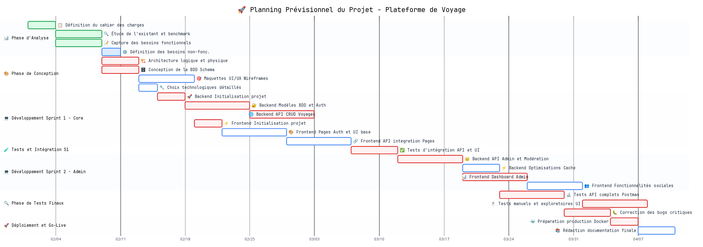

*Commentaire : Le diagramme de Gantt ci-dessus illustre la planification du projet sur environ 4 mois. On y observe les phases initiales d'analyse et de conception, suivies par deux grands sprints de développement en parallèle (Frontend/Backend) avec des phases de tests intermédiaires. Le projet se termine par une phase de tests finaux et le déploiement. Le chemin critique (marqué `crit`) met en évidence les tâches essentielles qui ne doivent pas prendre de retard pour respecter les délais.*

---

## Chapitre II : Etude Fonctionnelle

### 2.1 Etude de l'existant et Benchmarking

#### 2.1.1 Analyse concurrentielle

Cette section analyse les principaux acteurs du marché pour situer notre projet. L'étude se concentre sur leurs forces, leurs faiblesses et leur positionnement afin d'identifier les opportunités pour notre application.

**Tableau 2.1 : Analyse comparative des solutions existantes**

| Critère | TripAdvisor | Polarsteps | **Wanderlog** | **Notre Projet** |
| :--- | :--- | :--- | :--- | :--- |
| **Concept Principal** | Agrégateur d'avis et moteur de réservation. | Suivi de voyage automatisé et carnet de voyage photo. | Planificateur d'itinéraire collaboratif et guide de voyage. | Plateforme intégrée de planification, partage et découverte sociale. |
| **Fonctionnalités Clés**| - Avis et notes<br>- Réservation hôtels/vols<br>- Forums de voyageurs | - Suivi GPS de l'itinéraire<br>- Génération d'album photo automatique<br>- Statistiques de voyage | - Planification collaborative<br>- Import d'emails (vols, hôtels)<br>- Optimisation d'itinéraire sur carte<br>- Listes de lieux | - Planificateur d'itinéraire<br>- Partage social (feed)<br>- Gestion de budget<br>- Système d'avis<br>- Modération Admin |
| **Points Forts** | - Base de données massive<br>- Forte notoriété et confiance<br>- Contenu généré par les utilisateurs très riche | - Simplicité d'utilisation<br>- Concept "mains-libres" original<br>- Rendu esthétique des carnets de voyage | - Outils de planification très puissants<br>- Intégration carte excellente<br>- Collaboration en temps réel | - Approche "tout-en-un"<br>- Interface moderne et épurée<br>- Centré sur la communauté ("Social-by-design") |
| **Points Faibles** | - Interface vieillissante<br>- Expérience utilisateur fragmentée<br>- Publicité omniprésente | - Planification pré-voyage limitée<br>- Peu d'informations détaillées sur les lieux<br>- Modèle social basique | - Peut être complexe pour des besoins simples<br>- Moins axé sur le "souvenir" post-voyage<br>- Certaines fonctions clés sont payantes | - Communauté à construire<br>- Contenu initial limité<br>- Pas de réservation intégrée |
| **Modèle Économique** | Publicité, commissions sur réservation. | Vente de livres photo imprimés. | Freemium (Abonnement Wanderlog Pro pour fonctions avancées). | Potentiel : fonctionnalités premium, partenariats ciblés, B2B pour agences. |

#### 2.1.2 Benchmarking Technologique

Le choix de la stack technologique a été guidé par des critères de performance, de maturité de l'écosystème et de productivité de développement.

| Domaine | Technologie Choisie | Alternatives Considérées | Justification du Choix |
| :--- | :--- | :--- | :--- |
| **Base de Données** | **MongoDB (NoSQL)** | PostgreSQL (SQL) | La flexibilité du schéma de MongoDB est idéale pour une application sociale où les données (profils, posts) peuvent évoluer. Sa performance sur les lectures et écritures massives est également un atout majeur. |
| **Backend** | **Node.js / Express** | Python/Django, Java/Spring | L'écosystème JavaScript unifié (frontend et backend) simplifie le développement. L'architecture non-bloquante de Node.js est parfaitement adaptée à une API avec de nombreuses opérations d'I/O. |
| **Frontend** | **React** | Angular, Vue.js | L'écosystème de React est le plus vaste. Son approche par composants et le Virtual DOM offrent une grande flexibilité et performance. La disponibilité de bibliothèques comme Tanstack Query est un avantage décisif. |
| **Gestion d'état (Client)** | **Zustand + Tanstack Query** | Redux Toolkit, Apollo Client | `Zustand` offre une gestion simple de l'état global sans le "boilerplate" de Redux. `Tanstack Query` est la solution de référence pour la gestion de l'état serveur (caching, synchronisation), la séparant proprement de l'état client. |

### 2.2 Capture des besoins fonctionnels

#### 2.2.1 Diagramme des cas d'utilisation

**Fig. 2.1 : Diagramme global des cas d'utilisation**

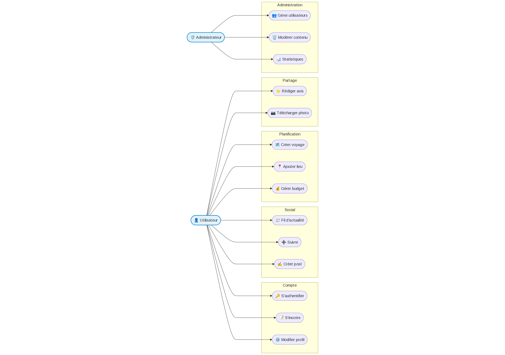

*Commentaire : Ce diagramme montre les deux acteurs principaux, l'Utilisateur et l'Administrateur, et les ensembles de fonctionnalités qui leur sont accessibles. On distingue clairement les cas d'utilisation liés à la gestion de compte, à la planification, à l'interaction sociale et à l'administration.*

#### 2.2.2 Description textuelle détaillée

Voici une description détaillée des cas d'utilisation les plus importants du système.

**Cas d'Utilisation 1 : S'inscrire sur la plateforme**

* **ID:** UC-001
* **Titre:** S'inscrire sur la plateforme
* **Description:** Un nouveau visiteur souhaite créer un compte pour accéder aux fonctionnalités de l'application.
* **Acteur:** Visiteur
* **Déclencheur:** Le visiteur clique sur le bouton "S'inscrire".
* **Préconditions:** Aucune.
* **Postconditions:** Un nouveau compte utilisateur est créé avec le statut "non vérifié". Un email de vérification est envoyé à l'adresse fournie. L'utilisateur est connecté et redirigé vers la page d'accueil.
* **Scénario Nominal:**
    1. Le visiteur remplit le formulaire d'inscription (nom d'utilisateur, email, mot de passe).
    2. Le système valide la conformité des données (voir EX1, EX2).
    3. Le système vérifie l'unicité du nom d'utilisateur et de l'email (voir EX3).
    4. Le système hache le mot de passe.
    5. Le système enregistre le nouvel utilisateur en base de données.
    6. Le système envoie un email de vérification.
    7. Le système génère un JWT, le place dans un cookie et connecte l'utilisateur.
* **Exceptions:**
  * **EX1: Données invalides.** Le système affiche un message d'erreur. Retour à l'étape 1.
  * **EX2: Mot de passe trop faible.** Le système affiche les exigences de mot de passe. Retour à l'étape 1.
  * **EX3: Email ou nom d'utilisateur déjà utilisé.** Le système affiche un message d'erreur. Retour à l'étape 1.

**Cas d'Utilisation 2 : Créer un voyage**

* **ID:** UC-002
* **Titre:** Créer un nouveau voyage
* **Description:** Un utilisateur authentifié souhaite démarrer la planification d'un nouveau voyage en créant un itinéraire de base.
* **Acteur:** Utilisateur (connecté)
* **Déclencheur:** L'utilisateur clique sur le bouton "Créer un voyage".
* **Préconditions:** L'utilisateur doit être authentifié.
* **Postconditions:** Un nouveau voyage est créé et associé au profil de l'utilisateur. L'utilisateur est redirigé vers la page de gestion de ce voyage.
* **Scénario Nominal:**
    1. L'utilisateur remplit les informations principales du voyage (Titre, dates de début et de fin, description).
    2. L'utilisateur définit la visibilité du voyage (Public, Privé).
    3. L'utilisateur soumet le formulaire.
    4. Le système valide les données (ex: la date de fin ne peut pas être antérieure à la date de début).
    5. Le système enregistre le nouveau voyage en base de données.
    6. Le système redirige l'utilisateur vers la page détaillée du voyage nouvellement créé.
* **Exceptions:**
  * **EX1: Données invalides.** Le système affiche des messages d'erreur clairs sous les champs concernés.

**Cas d'Utilisation 3 : Suivre un autre utilisateur**

* **ID:** UC-003
* **Titre:** Suivre un autre utilisateur
* **Description:** Un utilisateur souhaite s'abonner au contenu d'un autre utilisateur pour voir ses voyages publics et ses posts dans son fil d'actualité.
* **Acteur:** Utilisateur (connecté)
* **Déclencheur:** L'utilisateur clique sur le bouton "Suivre" sur le profil d'un autre utilisateur.
* **Préconditions:** L'utilisateur doit être authentifié et ne doit pas déjà suivre l'utilisateur cible.
* **Postconditions:** Une relation "suit" est créée entre les deux utilisateurs. Le contenu de l'utilisateur suivi apparaîtra dans le fil d'actualité de l'utilisateur suiveur.
* **Scénario Nominal:**
    1. L'utilisateur navigue vers le profil d'un autre utilisateur.
    2. L'utilisateur clique sur "Suivre".
    3. Le système enregistre la nouvelle relation d'abonnement en base de données.
    4. Le bouton "Suivre" se transforme en "Ne plus suivre".
* **Exceptions:**
  * **EX1: L'utilisateur essaie de se suivre lui-même.** Le système n'affiche pas le bouton "Suivre" sur le propre profil de l'utilisateur.

**Cas d'Utilisation 4 : Rédiger un avis sur un lieu**

* **ID:** UC-004
* **Titre:** Rédiger un avis
* **Description:** Un utilisateur authentifié souhaite partager son expérience sur un lieu (restaurant, hôtel, etc.) qu'il a visité.
* **Acteur:** Utilisateur (connecté)
* **Déclencheur:** L'utilisateur clique sur "Donner un avis" sur la page d'un lieu.
* **Préconditions:** L'utilisateur doit être authentifié. Le lieu doit exister dans la base de données.
* **Postconditions:** Le nouvel avis est sauvegardé. La note moyenne du lieu est mise à jour. L'avis est visible sur la page du lieu et potentiellement sur le profil de l'utilisateur.
* **Scénario Nominal:**
    1. L'utilisateur sélectionne une note (de 1 à 5).
    2. L'utilisateur rédige un commentaire textuel.
    3. L'utilisateur peut optionnellement ajouter des photos.
    4. L'utilisateur soumet l'avis.
    5. Le système valide les données (note et commentaire obligatoires).
    6. Le système enregistre l'avis en base de données.
    7. Le système recalcule et met à jour la note moyenne du lieu concerné.
* **Exceptions:**
  * **EX1: L'utilisateur a déjà laissé un avis pour ce lieu.** Le système propose de modifier l'avis existant.

**Cas d'Utilisation 5 : Modérer un contenu**

* **ID:** UC-005
* **Titre:** Modérer un contenu
* **Description:** Un administrateur ou un modérateur souhaite supprimer un contenu (avis, post) qui a été signalé comme inapproprié.
* **Acteur:** Administrateur / Modérateur
* **Déclencheur:** L'administrateur accède au tableau de bord de modération et sélectionne un contenu signalé.
* **Préconditions:** L'utilisateur doit être authentifié et avoir un rôle d'administrateur ou de modérateur.
* **Postconditions:** Le contenu ciblé est supprimé de la plateforme. L'auteur du contenu peut être notifié.
* **Scénario Nominal:**
    1. L'administrateur consulte la liste des contenus signalés.
    2. Il examine le contenu et le motif du signalement.
    3. Il décide de supprimer le contenu et clique sur "Supprimer".
    4. Le système demande une confirmation.
    5. Après confirmation, le système supprime le contenu de la base de données.
    6. Le contenu n'est plus visible sur l'application.
* **Exceptions:**
  * **EX1: L'administrateur décide que le contenu n'est pas inapproprié.** Il rejette le signalement, et le contenu reste visible.

### 2.3 Besoins non fonctionnels détaillés

* **Sécurité :**
  * **Défense en profondeur :** La sécurité est assurée par une approche multi-couches. Chaque requête traverse une chaîne de middlewares de sécurité (`helmet`, `hpp`, `express-rate-limit`, `xss`) avant même d'atteindre la logique applicative.
  * **Gestion de l'authentification :** Le flux JWT utilise des access tokens à courte durée de vie (ex: 15 min) et des refresh tokens à plus longue durée de vie (ex: 7 jours) stockés dans des cookies `HttpOnly`, ce qui rend le vol de token via XSS très difficile. Le `refresh token` permet de renouveler silencieusement la session sans que l'utilisateur ait à se reconnecter.
  * **Contrôle d'accès basé sur les rôles (RBAC) :** Les middlewares `isAdmin` et `isModerator` ne se contentent pas de vérifier un booléen. Ils sont le point d'entrée d'une logique d'autorisation qui pourrait être étendue (ex: permissions granulaires). Ils garantissent une séparation stricte des privilèges.
* **Performance et Scalabilité :**
  * **Stratégie de Caching :** Le caching `Redis` est appliqué intelligemment sur les routes `GET` coûteuses et fréquemment demandées (ex: `/destinations/popular`, `/trips/public`). Les clés de cache sont structurées (ex: `cache:trips:public`) pour permettre une invalidation granulaire (ex: vider tout le cache des voyages via `clearCache('cache:trips:*')` lorsqu'un nouveau voyage public est créé).
  * **Optimisation Frontend :** `Vite` est configuré pour le "code splitting" automatique par route. Ainsi, l'utilisateur ne télécharge que le code JavaScript nécessaire à la page qu'il visite. Les images bénéficieront de "lazy loading" pour ne charger que celles visibles à l'écran.
  * **Architecture "Stateless" :** Le backend est conçu pour être "stateless" (sans état). L'état de la session est entièrement contenu dans le JWT côté client. Cela signifie que l'on peut déployer plusieurs instances du backend derrière un load balancer pour une scalabilité horizontale facile.
* **Fiabilité et Maintenabilité :**
  * **Journalisation (Logging) :** `Winston` est configuré pour enregistrer les logs dans des fichiers rotatifs (`winston-daily-rotate-file`). Les niveaux de logs (info, warn, error) permettent de filtrer les informations. En production, seuls les avertissements et les erreurs sont enregistrés, tandis qu'en développement, le logging est plus verbeux pour faciliter le débogage.
  * **Gestion des erreurs centralisée :** Un middleware de gestion d'erreur final est mis en place dans `Express`. Il intercepte toutes les erreurs non capturées, les journalise, et renvoie une réponse JSON propre au client (sans fuite de détails d'implémentation).

### 2.4 Diagramme de classes du domaine

**Fig. 2.2 : Diagramme de Base Donnee**
*Commentaire: Ce diagramme a été amélioré et diviser pour montrer plus de détails sur les attributs et les cardinalités.*

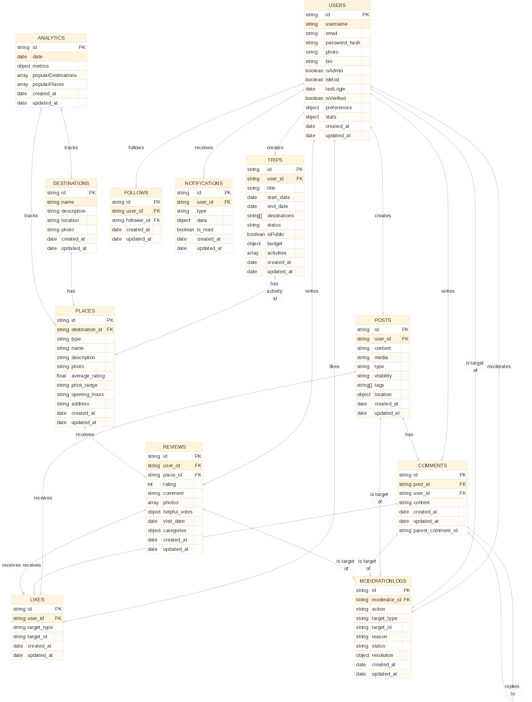

*Commentaire: Ce diagramme de classes UML illustre les entités principales. La classe `User` est centrale. La relation réflexive sur `User` modélise le système de "follow". Les cardinalités (ex: "1..*") précisent les relations entre les objets.*

**Fig. 2.3 : Diagramme de Methodes**

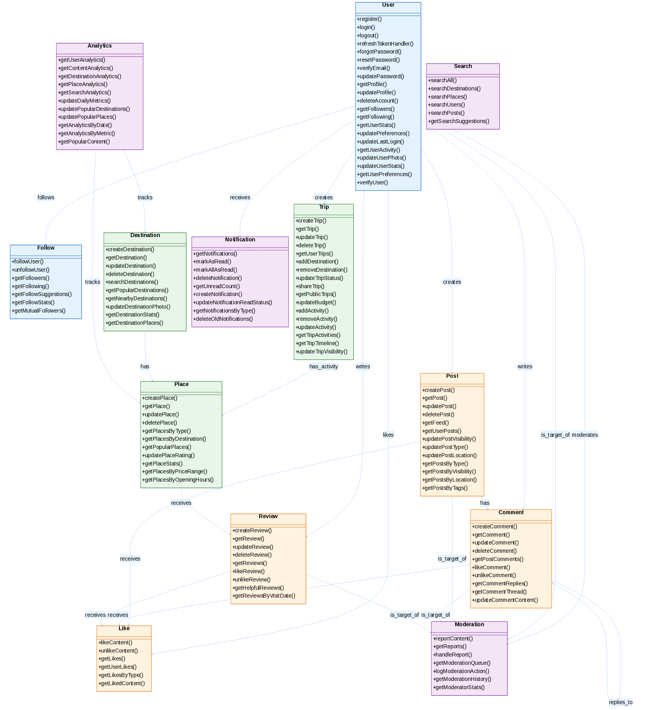

---

## Chapitre III : Etude Technique

### 3.1 Architecture logique de l'application

L'architecture N-tiers est un standard éprouvé qui garantit la séparation des préoccupations (`Separation of Concerns`), un principe fondamental en ingénierie logicielle.

**Fig. 3.1 : Diagramme d'architecture logique détaillée**

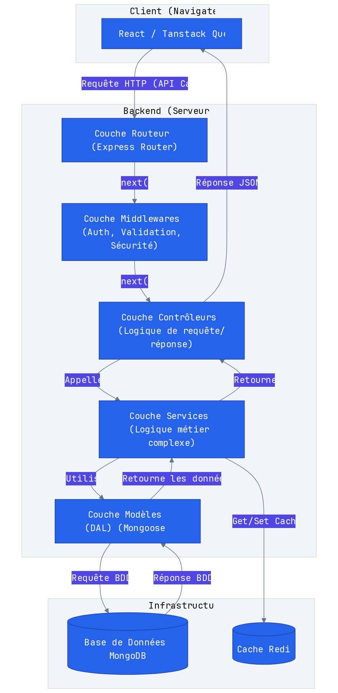

*Commentaire: Ce schéma illustre le flux d'une requête HTTP depuis le navigateur de l'utilisateur jusqu'à la base de données et retour. On y voit clairement le rôle de chaque couche: le Frontend pour la vue, le Backend pour la logique (Routes -> Middlewares -> Contrôleurs -> Services/Models) et la couche Persistance pour le stockage. Une couche de cache (Redis) est également représentée pour optimiser les performances.*

**Flux de données typique (Exemple: Créer un voyage)**

1. **Client (React):** L'utilisateur soumet le formulaire. `Tanstack Query` envoie une requête `POST /api/trips` avec les données du voyage. L'UI passe en état de chargement.
2. **Routeur (Express):** La requête correspond à la route `POST /api/trips`. Le routeur passe la main à la chaîne de middlewares associée.
3. **Middlewares (Express):** La requête traverse `protect` (vérifie le JWT), `tripValidator` (valide les données). Si tout est correct, `next()` est appelé.
4. **Contrôleur (tripController):** La fonction `createTrip` est exécutée. Elle appelle la logique métier.
5. **Modèle (Mongoose):** Le contrôleur utilise le modèle `Trip.create()` pour créer un document. Mongoose traduit cet appel en une requête `insert` pour MongoDB.
6. **Base de Données (MongoDB):** La base de données insère le document et renvoie le document créé.
7. **Retour:** La réponse remonte la chaîne : Mongoose renvoie l'objet au contrôleur, qui envoie une réponse JSON `201 Created` au client.
8. **Client (React):** `Tanstack Query` reçoit la réponse, met à jour son cache, et l'UI se rafraîchit pour afficher le nouveau voyage.

### 3.2 Architecture physique

Le déploiement en production d'une application web moderne repose sur une architecture distribuée, résiliente et scalable, exploitant les services cloud spécialisés.

* **Frontend (React) :** Déployé sur un service de hosting statique comme **Vercel** ou **Netlify**. Ces services offrent un CDN (Content Delivery Network) global, garantissant des temps de chargement rapides partout dans le monde, ainsi que des fonctionnalités de CI/CD intégrées.
* **Backend (Node.js) :** L'application est conteneurisée avec **Docker** pour assurer la portabilité et la reproductibilité de l'environnement. Le conteneur est ensuite déployé sur une plateforme PaaS (Platform as a Service) comme **Heroku**, **Render** ou **AWS Elastic Beanstalk**. Le PaaS permet une mise à l'échelle facile (horizontale et verticale).
* **Base de Données (MongoDB) :** Hébergée sur un service managé comme **MongoDB Atlas**. Cela délègue la complexité de la gestion de la BDD (sauvegardes, réplication, scaling, sécurité) à un fournisseur expert.
* **Cache (Redis) :** Hébergé sur un service managé comme **Upstash**, **Heroku Data for Redis** ou **AWS ElastiCache**. Utiliser un service managé simplifie la maintenance et garantit la haute disponibilité.
* **Stockage de fichiers (Média) :** Les fichiers uploadés par les utilisateurs (photos de profil, images de posts) sont stockés sur le serveur backend.

**Fig. 3.2 : Diagramme d'architecture de déploiement Cloud**

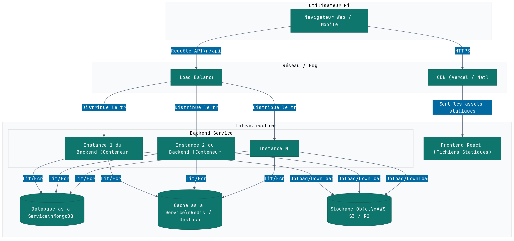

*Commentaire: Ce diagramme montre comment les différents composants de l'application sont déployés sur des services cloud indépendants et spécialisés. Le trafic est réparti par un Load Balancer entre plusieurs instances du backend, qui sont stateless. Les données, le cache et les fichiers sont gérés par des services managés externes pour une meilleure scalabilité et fiabilité.*

### 3.3 Technologies et outils utilisés - Justifications

| Domaine | Technologie | Version | Justification du Choix |
| :--- | :--- | :--- | :--- |
| **Backend** | Node.js | `22.x lts` | **Performance I/O :** Idéal pour une API qui attend souvent des réponses de la BDD. **Écosystème :** NPM est le plus grand registre de paquets au monde. **Langage unifié :** Permet de partager du code/logique (ex: validation) entre le front et le back. |
| | Express | `5.1.0` | **Minimalisme et Flexibilité :** N'impose pas de structure rigide. **Standard de facto :** Très grande communauté, nombreux tutoriels et middlewares disponibles pour presque tous les cas d'usage. |
| | Mongoose | `8.15.1` | **Abstraction :** Fournit une surcouche agréable pour interagir avec MongoDB. **Validation de schéma :** Permet de définir une structure pour les données au niveau applicatif, ajoutant une couche de robustesse. |
| **Frontend** | React | `19.1.0` | **Performance :** Le Virtual DOM minimise les manipulations directes du DOM. **Écosystème :** Accès à une quantité inégalée de bibliothèques et d'outils (Tanstack Query, Shadcn). **Recrutement :** Compétence la plus demandée sur le marché. |
| | Tanstack Query| `5.80.6` | **Séparation des états :** Sépare proprement l'état serveur (données API) de l'état client (UI), une bonne pratique d'architecture. **Expérience développeur :** Élimine une quantité massive de code répétitif pour la gestion des données asynchrones. |
| | Zod | `3.25.56`| **Inférence de type :** Permet de déclarer un schéma de validation et d'en déduire automatiquement le type TypeScript. **Isomorphique :** Les mêmes schémas peuvent être utilisés sur le serveur et sur le client. |
| **Styling** | TailwindCSS | `4.1.8` | **Productivité :** Permet de styler les composants directement dans le HTML/JSX sans changer de contexte. **Personnalisation :** Entièrement configurable pour correspondre à une charte graphique précise. **Performance :** Ne génère que les classes CSS réellement utilisées, produisant des fichiers CSS très légers. |

---

## Chapitre IV : Mise en œuvre et Extraits de Code

Cette section présente des extraits de code significatifs qui illustrent les concepts architecturaux décrits précédemment.

### 4.1 Architecture du projet (Arborescence)

Une structure de projet claire est essentielle pour la maintenabilité et la collaboration. L'approche monorepo a été écartée au profit de deux dépôts distincts (backend et frontend) pour une séparation nette des préoccupations.

**Fig. 4.1 : Arborescence du projet backend (Node.js/Express)**

```
/
backend
├── logs
└── src
    ├── Configs
    ├── Controllers
    ├── Middleware
    ├── Models
    ├── Routes
    └── Utils

```

*Commentaire: La structure du backend sépare clairement les `routes` (définition de l'API), les `controllers` (logique métier), les `models` (schémas BDD), les `middlewares` (logique transversale) et la `config`, ce qui rend le projet facile à maintenir.*

**Fig. 4.2 : Arborescence du projet frontend (React/Vite)**

```
/
frontend
├── public
└── src
    ├── Assets
    ├── Components
    ├── Hooks
    ├── Libs
    ├── Pages
    ├── Schemas
    ├── Stores
    ├── Styles
    └── Utils
```

*Commentaire: L'architecture frontend est organisée par fonctionnalités (`features`), ce qui améliore la scalabilité et la co-localisation du code lié. Les composants, hooks et services partagés sont placés dans des dossiers communs pour être réutilisés à travers l'application.*

### 4.2 Implémentation de la Sécurité

#### 4.2.1 Middleware de protection de route (`protect.js`)

Ce middleware est le gardien de nos routes sécurisées.

```javascript
export const protect = async (req, res, next) => {
  try {
    let token;

    // Get token from cookie or Authorization header
    if (req.cookies.token) {
      token = req.cookies.token;
    } else if (
      req.headers.authorization &&
      req.headers.authorization.startsWith("Bearer")
    ) {
      token = req.headers.authorization.split(" ")[1];
    }

    if (!token) {
      return errorResponse(res, {
        code: HTTP_STATUS.UNAUTHORIZED,
        message: "Not authorized to access this route",
      });
    }

    try {
      // Verify token
      const decoded = jwt.verify(token, JWT_SECRET);

      // Get user from token
      const user = await User.findById(decoded.id).select("-password");
      if (!user) {
        return errorResponse(res, {
          code: HTTP_STATUS.UNAUTHORIZED,
          message: "User not found",
        });
      }

      // Add user to request object
      req.user = user;
      next();
    } catch (error) {
      return errorResponse(res, {
        code: HTTP_STATUS.UNAUTHORIZED,
        message: "Not authorized to access this route",
      });
    }
  } catch (error) {
    return errorResponse(res, {
      code: HTTP_STATUS.INTERNAL_SERVER_ERROR,
      message: "Error in authentication middleware",
      error: error.message,
    });
  }
};


```

*Commentaire: Ce code montre le processus en 3 étapes : extraire le token, le vérifier avec le secret, et si valide, récupérer l'utilisateur correspondant et l'attacher à l'objet `req` pour qu'il soit disponible dans les prochains middlewares et contrôleurs.*

### 4.3 Implémentation de la logique métier

#### 4.3.1 Modèle de données Mongoose (`tripModel.js`)

```javascript
import mongoose from "mongoose";

const tripSchema = new mongoose.Schema(
  {
    user_id: {
      type: mongoose.Schema.Types.ObjectId,
      ref: "User",
      required: true,
    },
    title: {
      type: String,
      required: [true, "Title is required"],
      trim: true,
    },
    start_date: {
      type: Date,
      required: [true, "Start date is required"],
    },
    end_date: {
      type: Date,
      required: [true, "End date is required"],
    },
    destinations: [
      {
        type: String,
        required: true,
      },
    ],
    status: {
      type: String,
      enum: ["planning", "ongoing", "completed", "cancelled"],
      default: "planning",
    },
    isPublic: {
      type: Boolean,
      default: true,
    },
    budget: {
      amount: Number,
      currency: {
        type: String,
        default: "USD",
      },
    },
    activities: [
      {
        place_id: {
          type: mongoose.Schema.Types.ObjectId,
          ref: "Place",
        },
        date: Date,
        notes: String,
      },
    ],
  },
  {
    timestamps: true,
  }
);

const Trip = mongoose.model("Trip", tripSchema);

export default Trip;

```

*Commentaire: Ce schéma Mongoose définit la structure, les types, les validations (ex: `required`, `maxlength`) et les relations (via `ref: 'User'`) pour la collection `trips` dans MongoDB.*

#### 4.3.2 Contrôleur (`tripController.js`)

```javascript
import logger from "../Utils/logger.js";
import {
  successPatterns,
  errorPatterns,
  asyncHandler,
} from "../Utils/responses.js";

const NAMESPACE = "TripController";

/**
 * @desc    Create new trip
 * @route   POST /api/trips
 * @access  Private
 */
export const createTrip = asyncHandler(async (req, res) => {
  const { title, start_date, end_date, destinations, isPublic, budget } =
    req.body;

  const trip = await Trip.create({
    user_id: req.user._id,
    title,
    start_date,
    end_date,
    destinations,
    isPublic,
    budget,
  });

  // Update user's trip count
  await User.findByIdAndUpdate(req.user._id, {
    $inc: { "stats.tripsCount": 1 },
  });

  logger.logInfo(NAMESPACE, `Trip created: ${trip._id}`);
  return successPatterns.created(res, { data: trip });
});
```

*Commentaire: Ce contrôleur gère la création d'un voyage. Il est simple car la complexité (authentification, validation) a déjà été gérée par les middlewares. Il se contente d'ajouter l'ID de l'utilisateur au corps de la requête et d'appeler le modèle Mongoose pour créer le document.*

### 4.4 Implémentation Frontend

#### 4.4.1 Communication avec l'API (`useTrips.js` avec Tanstack Query)

```jsx
// hooks/useTrips.js (exemple)
import { useQuery, useMutation, useQueryClient } from '@tanstack/react-query';
import axios from 'axios';

const fetchTrips = () => axios.get('/api/trips').then(res => res.data);
const createTrip = (newTrip) => axios.post('/api/trips', newTrip);

export const useGetTrips = () => {
  return useQuery({
    queryKey: ['trips'], // Clé de cache pour cette requête
    queryFn: fetchTrips  // Fonction qui fetch les données
  });
};

export const useCreateTrip = () => {
  const queryClient = useQueryClient();

  return useMutation({
    mutationFn: createTrip,
    onSuccess: () => {
      // Invalider le cache 'trips' pour forcer un re-fetch
      queryClient.invalidateQueries({ queryKey: ['trips'] });
    },
  });
};
```

*Commentaire: Ce hook personnalisé abstrait la logique de communication avec l'API. `useGetTrips` récupère et met en cache les voyages. `useCreateTrip` gère la création et, en cas de succès (`onSuccess`), invalide le cache pour que la liste des voyages se mette automatiquement à jour.*

---

### 4.5 Galerie d'Interface Utilisateur

L'interface utilisateur a été conçue avec une approche "mobile-first", en privilégiant la clarté, la simplicité d'utilisation et une esthétique moderne. L'utilisation de TailwindCSS a permis de créer un design system cohérent et entièrement responsive, garantissant une expérience utilisateur optimale sur toutes les tailles d'écrans, du smartphone à l'ordinateur de bureau.

**Fig. 4.3 : Pages d'authentification**

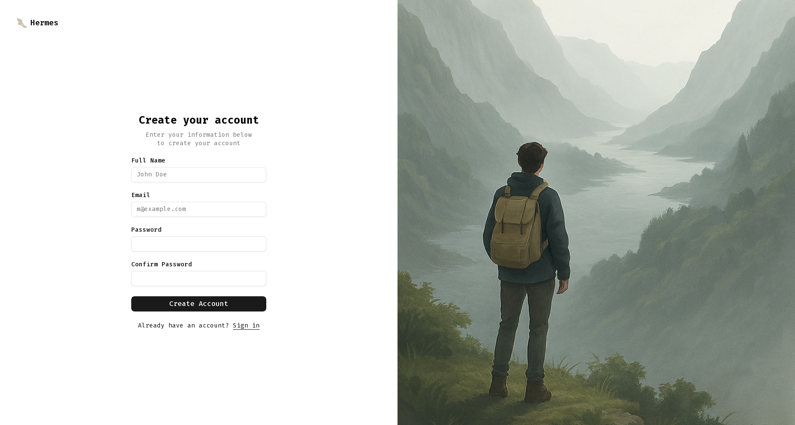
*Commentaire : Les formulaires de connexion et d'inscription sont épurés, avec des indications claires pour l'utilisateur et une validation instantanée des champs. Les versions mobiles (`LoginPageMobile.png`, `RegisterPageMobile.png`) suivent le même principe.*

**Fig. 4.4 : Fil d'actualité (Feed)**
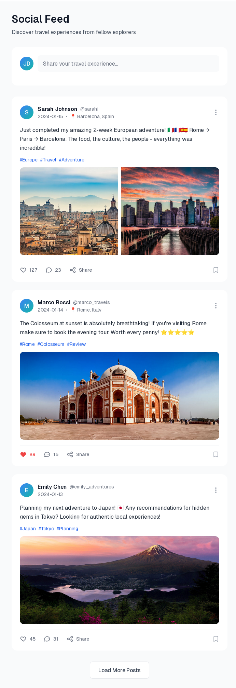
*Commentaire : Le fil d'actualité est la page d'accueil après connexion. Il présente les voyages et activités des utilisateurs suivis de manière visuelle et engageante. La navigation principale est accessible en haut.*

**Fig. 4.5 : Planificateur de voyage (Planner)**
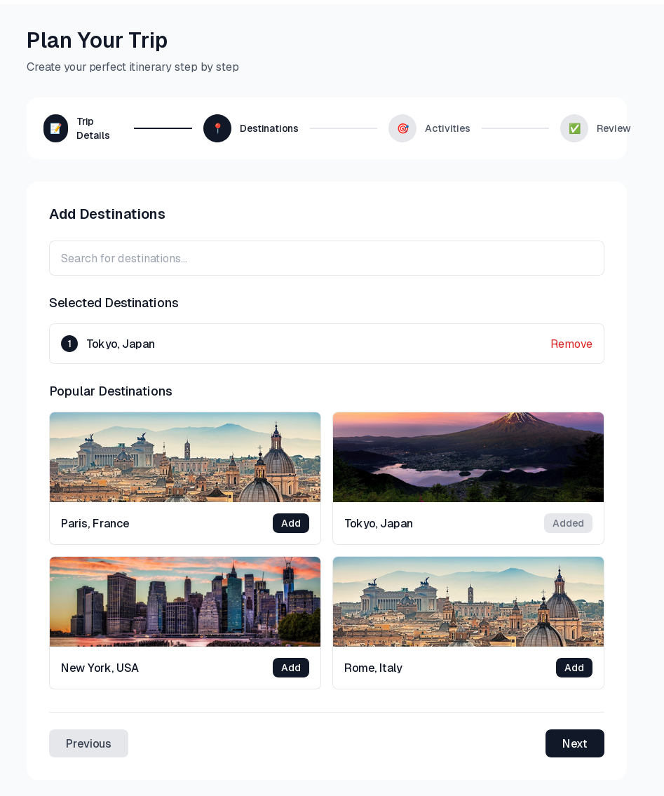
*Commentaire : L'interface de planification est le cœur fonctionnel de l'application. Elle permet de construire un itinéraire, d'ajouter des étapes, de visualiser le trajet sur une carte et de gérer les détails de chaque journée.*

**Fig. 4.6 : Page de profil utilisateur**
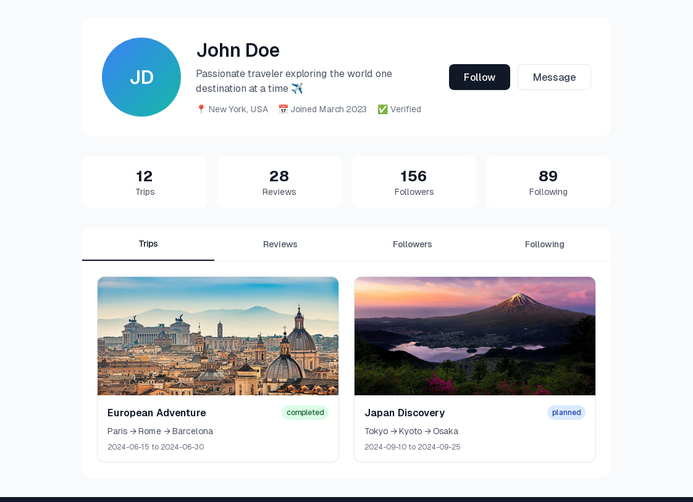
*Commentaire : Chaque utilisateur dispose d'un profil public présentant ses voyages, ses statistiques et ses publications. C'est également ici que les autres utilisateurs peuvent choisir de le suivre.*

**Fig. 4.7 : Page de lieu (Place)**
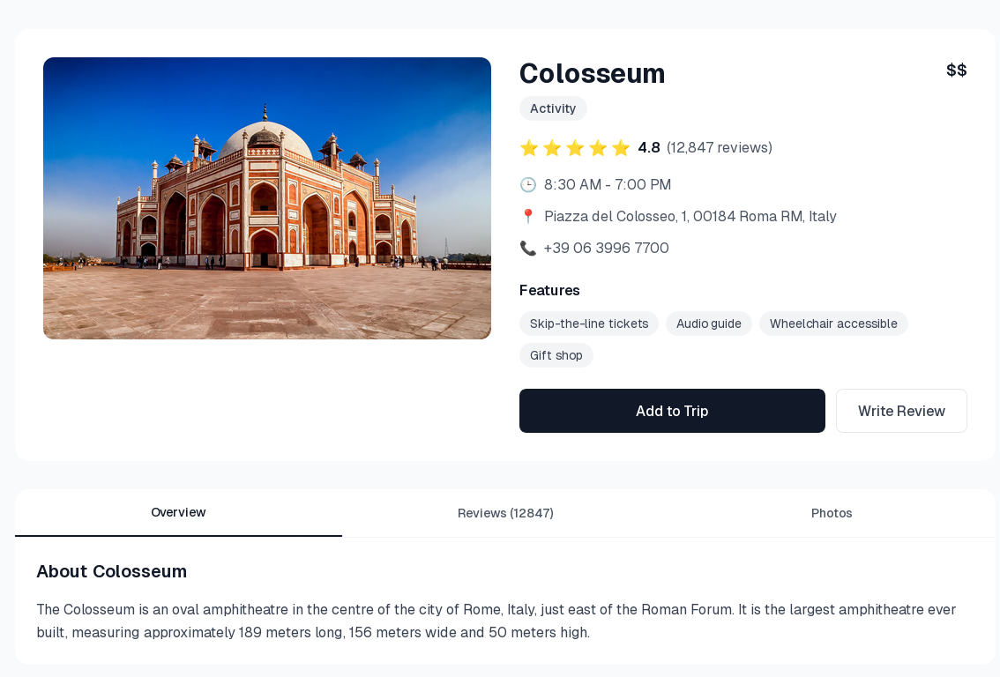
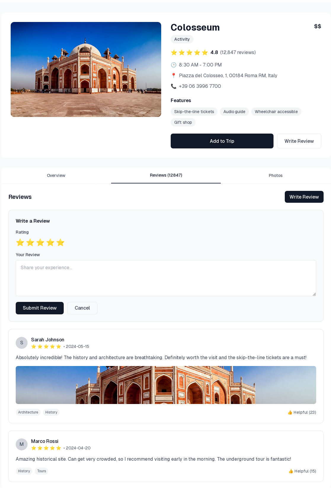
*Commentaire : Les pages de lieux fournissent des informations détaillées (description, carte, services) et agrègent les avis, notes et photos des autres voyageurs.*

**Fig. 4.8 : Page de recherche**
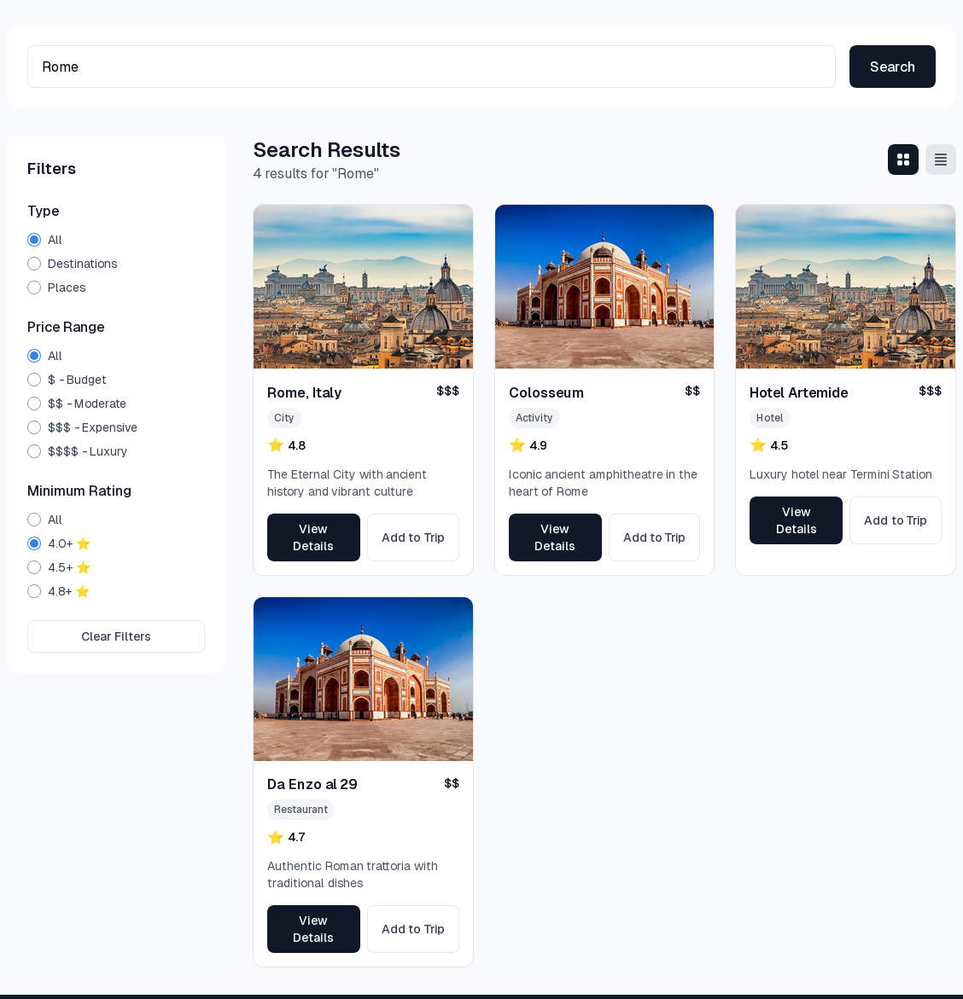
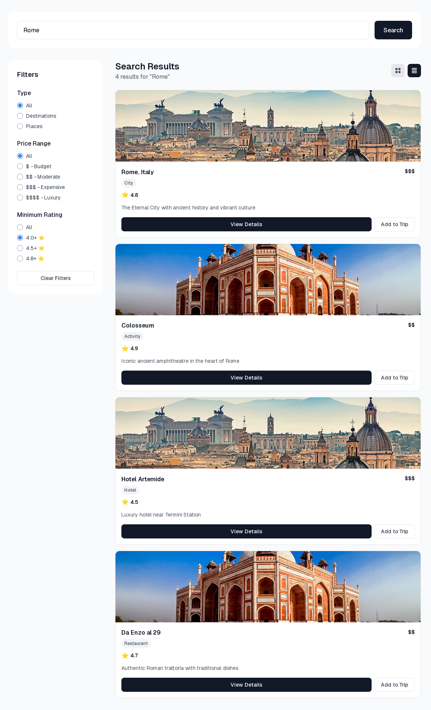
*Commentaire : La fonction de recherche est flexible, offrant des vues en grille (visuelle) ou en liste (dense) pour s'adapter aux préférences de l'utilisateur.*

**Fig. 4.9 : Examplaire Vues responsives sur mobile**
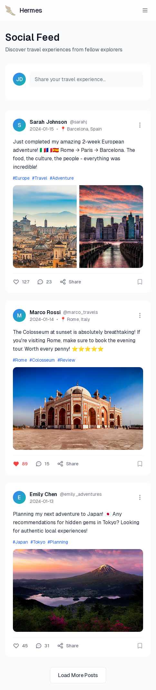
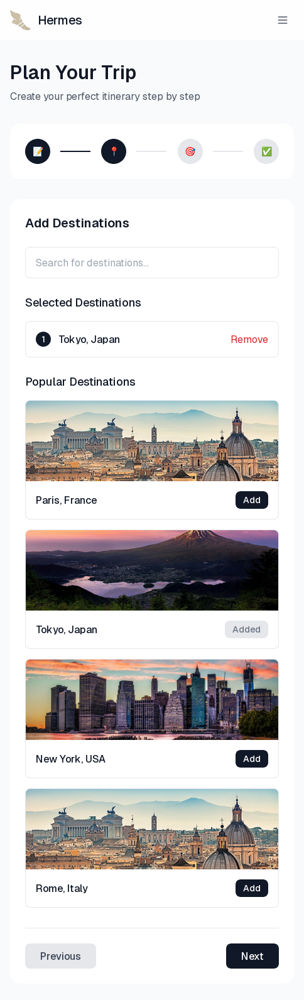
*Commentaire : L'application est entièrement responsive. Les interfaces complexes comme le fil d'actualité et le planificateur sont réorganisées pour une utilisation optimale sur des écrans plus petits, avec une navigation tactile.*

**Fig. 4.10 : Tableau de bord de l'administrateur**
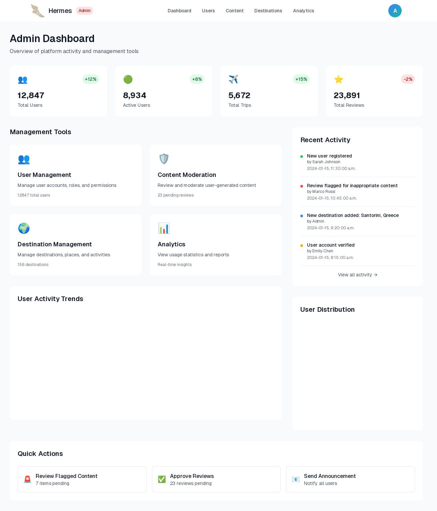
*Commentaire : Le back-office offre une vue d'ensemble de l'activité de la plateforme. Les administrateurs peuvent suivre les métriques clés et accéder rapidement aux différentes sections de gestion.*

**Fig. 4.11 : Gestion du contenu et des utilisateurs**

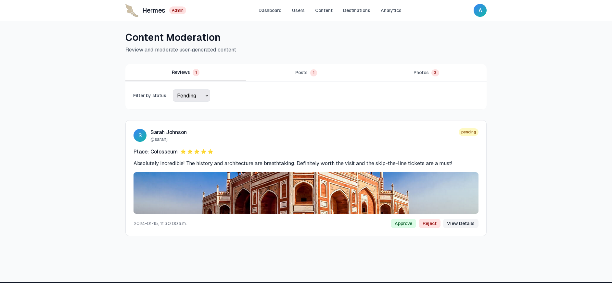
*Commentaire : Les administrateurs disposent d'outils dédiés pour la gestion des comptes utilisateurs (bannissement, vérification) et la modération des contenus signalés (avis, posts), garantissant la sécurité et la qualité de la communauté.*

**Fig. 4.12 : Gestion des destinations**
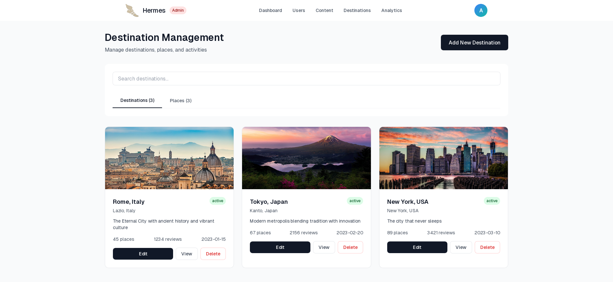
*Commentaire : Une interface spécifique permet aux administrateurs d'enrichir la base de données de l'application en ajoutant ou en modifiant des destinations, des lieux d'intérêt et leurs informations associées.*

---

## Chapitre V : Tests et Validation

Pour garantir la qualité, la robustesse et la non-régression de l'application, une stratégie de test pragmatique et ciblée a été mise en œuvre. Plutôt que de viser une couverture de test automatisée complète, l'approche s'est concentrée sur les aspects les plus critiques du système : la validation de la logique backend via des tests d'API et la vérification du comportement du frontend par des tests manuels et exploratoires approfondis.

### 5.1 Stratégie de Test Adoptée

La stratégie de test a été divisée en deux volets complémentaires :

1. **Tests d'API (Backend) :** Le backend constitue le cœur du système, abritant toute la logique métier et les règles de sécurité. Une défaillance à ce niveau aurait des conséquences critiques. Par conséquent, chaque endpoint de l'API a été systématiquement testé à l'aide de Postman. Cette approche a permis de valider de manière rigoureuse les contrats d'interface, les flux de données, la gestion des erreurs et l'application des règles de sécurité (authentification et autorisation).

2. **Tests Manuels et Exploratoires (Frontend) :** Le frontend, étant l'interface directe avec l'utilisateur, a été validé par des tests manuels. Cette méthode permet non seulement de vérifier que les fonctionnalités sont conformes aux spécifications, mais aussi d'évaluer l'expérience utilisateur (UX) de manière qualitative. En utilisant des outils d'aide au débogage comme les React DevTools, ces tests manuels ont été augmentés d'une inspection technique précise de l'état des composants et des flux de données côté client.

### 5.2 Outils de Test

| Outil | Type de Test | Justification du Choix |
| :--- | :--- | :--- |
| **Postman** | Tests d'API (Backend) | Outil de référence pour le développement d'API. Il permet de construire et d'exécuter des requêtes HTTP complexes, d'organiser les tests en collections, d'automatiser des suites de tests pour les endpoints et de valider les schémas de réponse et les codes de statut via des scripts d'assertion. |
| **React DevTools** | Débogage & Inspection (Frontend) | Extension de navigateur essentielle pour inspecter la hiérarchie des composants React, visualiser et manipuler l'état (géré par Zustand et Tanstack Query) en temps réel, et profiler les performances de rendu pour identifier les goulots d'étranglement. |
| **Outils de développement du Navigateur** | Tests Manuels & Débogage | Indispensables pour tout développement web. Ils ont été utilisés pour inspecter le DOM, déboguer le code JavaScript, analyser le trafic réseau (vérification des appels API), et simuler différentes tailles d'écran pour valider le responsive design. |

### 5.3 Exemples de Scénarios de Test

#### 5.3.1 Scénario de Test Backend avec Postman

**Objectif :** Valider le endpoint de création de voyage (`POST /api/trips`).

Une collection Postman a été créée pour les routes "Trips", contenant des requêtes pour chaque action CRUD.

* **Test Case 1 : Création réussie par un utilisateur authentifié**
    1. **Prérequis :** Exécuter une requête `POST /api/auth/login` avec des identifiants valides pour obtenir un JWT. Le token est automatiquement stocké dans une variable d'environnement Postman.
    2. **Requête :** Envoyer une requête `POST` à `{{URL}}/api/trips`. Le token est inclus dans les cookies de la requête. Le `body` de la requête contient un JSON valide pour un nouveau voyage.

* **Test Case 2 : Échec car l'utilisateur n'est pas authentifié**
    1. **Requête :** Envoyer la même requête `POST` à `{{URL}}/api/trips`, mais cette fois en s'assurant qu'aucun token d'authentification n'est envoyé.

#### 5.3.2 Scénario de Test Manuel Frontend

**Objectif :** Valider le formulaire de création de voyage du point de vue de l'utilisateur.

* **Scénario de test :**
    1. **Connexion :** Se connecter à l'application avec un compte de test.
    2. **Navigation :** Accéder à la page de création d'un nouveau voyage.
    3. **Inspection initiale :** Ouvrir les **React DevTools**. Sélectionner le composant du formulaire de voyage pour inspecter son état initial et ses `props`.
    4. **Test du cas passant :**
        * Remplir le formulaire avec des données valides (titre, dates, etc.).
        * Cliquer sur le bouton "Créer le voyage".
    5. **Vérifications multiples :**
        * **Réseau :** Dans l'onglet "Network" des outils du navigateur, observer qu'une requête `POST` est envoyée à `/api/trips` avec le bon `payload` et qu'elle reçoit une réponse `201`.
        * **État React :** À l'aide des **React DevTools** et de l'extension dédiée à Tanstack Query, observer que le cache de la requête `['trips']` est bien invalidé, déclenchant une nouvelle récupération des données pour mettre la liste des voyages à jour.
        * **UI :** Constater que l'utilisateur est bien redirigé vers la nouvelle page du voyage et qu'un message de succès s'affiche.
    6. **Test du cas d'erreur (validation front) :**
        * Rafraîchir la page et tenter de soumettre le formulaire avec des données invalides (ex: une date de fin antérieure à la date de début).
    7. **Vérifications :**
        * **UI :** Constater que des messages d'erreur clairs apparaissent sous les champs concernés et que le bouton de soumission est potentiellement désactivé.
        * **État React :** Avec les **React DevTools**, vérifier que l'état du composant reflète maintenant ces erreurs de validation.
        * **Réseau :** Confirmer dans l'onglet "Network" qu'aucune requête API n'a été envoyée, ce qui prouve que la validation côté client a bien fonctionné.

---

## Conclusion

Ce projet de fin d'études a permis de mener à bien le cycle complet de conception, de développement et de planification du déploiement d'une application web moderne de "social travel". L'objectif initial, qui était de créer une plateforme intégrée pour la planification de voyages et le partage d'expériences, a été atteint avec succès.

**Bilan des réalisations**
La solution développée, basée sur la stack MERN, offre un socle fonctionnel robuste. Les utilisateurs peuvent gérer leur profil, planifier des itinéraires détaillés, et partager leurs expériences à travers des avis et des posts. Le système d'authentification sécurisé basé sur JWT, l'architecture backend N-tiers et une interface frontend réactive construite avec React et Tanstack Query constituent les piliers de cette réalisation. Le back-office d'administration, bien que basique, fournit les outils nécessaires à la modération et à la gestion des utilisateurs, assurant la viabilité à long terme de la plateforme. La valeur ajoutée de ce projet réside dans son approche "tout-en-un", qui contraste avec les solutions existantes souvent spécialisées soit dans la planification, soit dans le partage social.

**Défis et solutions apportées**
Le principal défi technique a été la gestion de l'état asynchrone et du cache côté client. L'adoption de **Tanstack Query** a été une solution déterminante, permettant de simplifier drastiquement la communication avec l'API, d'optimiser le rafraîchissement des données et d'améliorer l'expérience utilisateur perçue. Un autre défi majeur fut la mise en place d'un flux d'authentification à la fois sécurisé et fluide. La stratégie combinant des `access tokens` à courte durée de vie et des `refresh tokens` stockés dans des cookies `HttpOnly` a permis de répondre à cette problématique en suivant les meilleures pratiques actuelles.

**Limites et perspectives d'évolution**
Malgré ses fonctionnalités, l'application présente des limites inhérentes à un projet de cette envergure. L'absence de fonctionnalités temps réel comme la messagerie instantanée ou la planification collaborative simultanée est une piste d'amélioration majeure. Le moteur de recherche pourrait être enrichi avec des filtres plus avancés (par budget, par type d'activité, etc.). À plus long terme, plusieurs évolutions sont envisageables :

* **Application Mobile Native :** Développer une application iOS/Android en React Native pour capitaliser sur la base de code JavaScript existante et offrir une meilleure expérience mobile.
* **Intelligence Artificielle :** Intégrer un système de recommandations basé sur le machine learning pour suggérer des destinations, des activités ou des utilisateurs à suivre.
* **Monétisation :** Implémenter des fonctionnalités "premium" (planification avancée, stockage illimité de photos) via un système d'abonnement.
* **Intégrations tierces :** Permettre la réservation d'hôtels ou d'activités directement depuis la plateforme via des API partenaires.

**Apports du projet**
Ce projet a été une expérience extrêmement formatrice. Sur le plan technique, il m'a permis de consolider ma maîtrise de l'écosystème JavaScript/TypeScript, de l'architecture full-stack MERN et des défis liés au déploiement d'applications web scalables. Sur le plan méthodologique, la gestion du projet, bien que simplifiée, a nécessité une planification rigoureuse et une approche itérative pour respecter les échéances. Enfin, sur le plan personnel, ce travail a renforcé mon autonomie, ma capacité à rechercher des solutions techniques complexes et à mener un projet d'ingénierie logicielle de sa conception à sa conclusion.

---

## Webographie / Bibliographie

*Les liens suivants constituent une sélection des ressources techniques et conceptuelles clés utilisées tout au long du projet.*

* **Documentation Officielles :**
  * Documentation de Node.js : <https://nodejs.org/en/docs/>
  * Documentation d'Express.js : <https://expressjs.com/>
  * Documentation de React : <https://react.dev/>
  * Documentation de Mongoose : <https://mongoosejs.com/docs/guides.html>
  * Documentation de MongoDB : <https://www.mongodb.com/docs/>
  * Documentation de Tanstack Query : <https://tanstack.com/query/latest/docs/react/overview>
  * Documentation de Zustand : <https://github.com/pmndrs/zustand>
  * Documentation de Zod : <https://zod.dev/>
  * Documentation de Tailwind CSS : <https://tailwindcss.com/docs>
  * Documentation de Postman : <https://learning.postman.com/docs/getting-started/introduction/>

* **Articles et Guides de référence :**
  * OWASP Cheat Sheet Series (pour les bonnes pratiques de sécurité) : <https://cheatsheetseries.owasp.org/>
  * "DigitalOcean Community Tutorials" pour divers guides sur Node.js et le déploiement.
  * Articles de blog de "web.dev" par les équipes de Google Chrome sur les performance web.
  * Vidéos de Fireship.io pour des aperçus concis sur les technologies et architectures.
