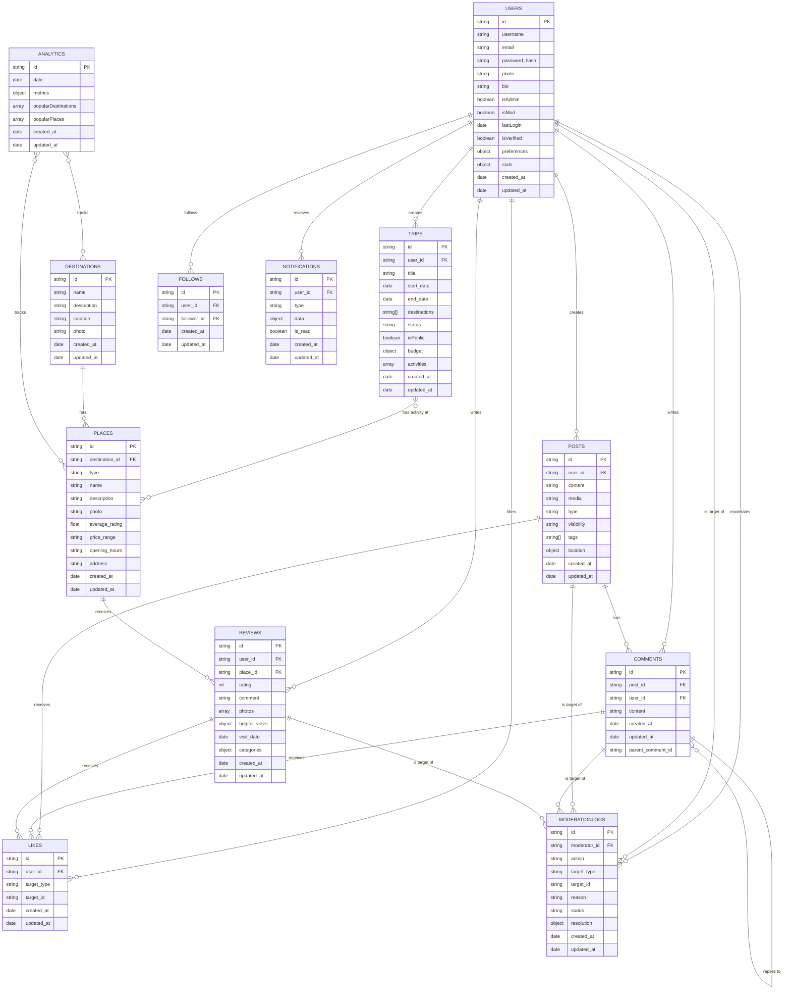

# Vacation Planning & Experience Sharing App — Roadmap & Strategy

---

## Introduction

This document provides a comprehensive roadmap and strategy for your end-of-study project: a vacation planning and experience sharing application. Built with the MERN stack (MongoDB, Express, React, Node.js), TailwindCSS, Shadcn-ui, Tanstack-Query, Zustand, and Zod (using only JSX, no TypeScript), the app is designed to help users plan trips, share experiences, receive recommendations, and manage their data. Admin features for user and content management are also considered.

---

## Tech Stack

### Backend : Express + Mongoose + Redis

### Frontend : React JSX + TailwindCSS + Shadcn-ui + Zod + Zustand + Tanstack-Query

## Key Strategy & Approach

- **Prioritize user features:** Focus on building the main application first (trip planning, sharing, recommendations, etc.) to ensure a solid, functional core for your project deadline.
- **Plan for admin from the start:** Design your database and authentication to support admin roles and permissions, even if admin features are implemented later.
- **Add admin features after core is complete:** Once user-facing features are functional, implement admin pages for user/content management and analytics.

### Why This Approach?

- **User-centric:** The core features are what evaluators and users will interact with first.
- **Time management:** Admin features can be complex; building the main app first ensures a working product within the deadline.
- **Smooth integration:** Early planning for admin roles and APIs avoids major refactoring later.

---

## Phased Roadmap: Pages & Features

### Phase 1: User-Facing Pages & Features

| Page                     | Description                                                                 | Features                                                                 |
|--------------------------|-----------------------------------------------------------------------------|-------------------------------------------------------------------------|
| Home Page                | Entry point with search and featured destinations                            | Navigation bar, search bar, featured trips, login/signup buttons         |
| Sign Up/Login Pages      | Forms for user authentication                                                | Email, username, password fields; validation with Zod                   |
| Profile Page             | User information and activities                                              | User details, tabs for trips, reviews, followers/following              |
| Trip Planning Page       | Interface for creating and editing itineraries                               | Form for trip name, dates, add destinations and places, save button     |
| Destination Page         | Details on specific destinations                                             | Name, description, photos, lists of accommodations, restaurants, activities |
| Place Page               | Details on specific places (accommodations, restaurants, activities)         | Details, photos, reviews, ratings, add to trip, write review options    |
| Search Results Page      | Display results from searches                                                | Search bar, filters (type, price, rating), list of destinations/places  |
| Social Feed Page         | Display shared posts from followed users                                     | Posts (reviews, trip shares), like, comment options                     |
| Trip Visualization Page  | View detailed itineraries                                                    | Display itinerary, edit option (if owner)                               |

**Key User Features:**

- **Authentication:** JWT-based login, Zustand for state, Zod for validation.
- **Trip Planning:** Create/manage itineraries, store in MongoDB, Tanstack-Query for data.
- **Experience Sharing:** Write reviews, rate places, upload photos.
- **Recommendations:** Show popular destinations/places based on ratings.
- **Search:** Text search and filters, server-side with MongoDB.
- **Social Interactions:** Follow users, like/comment on posts.

### Phase 2: Admin-Related Pages & Features

| Page                     | Description                                                                 | Features                                                                 |
|--------------------------|-----------------------------------------------------------------------------|-------------------------------------------------------------------------|
| Admin Dashboard          | Overview for administrators                                                 | Summary of users, content, analytics, navigation to admin pages         |
| User Management Page     | Manage user accounts                                                        | List users, ban/unban, verify accounts, edit roles                      |
| Content Moderation Page  | Manage user-generated content (reviews, photos)                              | List reviews, flag/delete/approve content                               |
| Destination Management   | Manage destinations and places                                               | Add, edit, delete destinations, accommodations, restaurants, activities |
| Analytics Page           | View usage statistics and reports                                            | Graphs of user activity, popular destinations, engagement metrics       |

**Key Admin Features:**

- **User Management:** CRUD for users, role-based access, server-side verification.
- **Content Moderation:** Review/moderate user content, log actions.
- **Destination Management:** Add/update destinations and places.
- **Analytics:** Reports on user activity, trip creation, engagement.

---

## Technical Considerations

- **Frontend:** React with JSX, TailwindCSS for styling, Shadcn-ui for UI components.
- **State Management:** Zustand for global state, Tanstack-Query for API data and caching.
- **Validation:** Zod for all forms and user/admin input.
- **Security:** Role-based access for admin, protected routes, server-side checks.
- **Backend:** Express routes for CRUD operations, with endpoints for both user and admin features.

---

## Database Structure

| Collection        | Main Fields                                                                                                 | Purpose                                                      |
|-------------------|------------------------------------------------------------------------------------------------------------|--------------------------------------------------------------|
| Users             | id, username, email, password (hash), photo, bio, isAdmin, isMod                                           | User accounts, roles, and profile info                       |
| Trips             | id, user_id, title, start_date, end_date, destinations                                                      | User-created trip itineraries                                |
| Destinations      | id, name, description, location, photo                                                                      | Destination data                                             |
| Places            | id, destination_id, type (accommodation, restaurant, activity), name, description, photo, average_rating    | Places within destinations                                   |
| Reviews           | id, user_id, place_id, rating, comment, photos                                                              | User reviews for places                                      |
| Follows           | user_id, follower_id                                                                                        | User follow relationships                                    |
| Posts             | id, user_id, content, media, created_at, updated_at                                                         | Social posts (trip shares, updates, etc.)                    |
| Comments          | id, post_id, user_id, content, created_at, parent_comment_id (nullable)                                     | Comments and replies on posts                                |
| Likes             | id, user_id, target_type (post/comment/review), target_id, created_at                                      | Likes on posts, comments, or reviews                         |
| Notifications     | id, user_id, type, data, is_read, created_at                                                                | User notifications (mentions, follows, likes, etc.)          |
| ModerationLogs    | id, moderator_id, action, target_type, target_id, reason, created_at                                        | Record of moderation actions                                 |

**Notes:**

- `isAdmin` and `isMod` in Users allow for both admin and moderator roles.
- `Posts` and `Comments` collections enable a social feed and threaded discussions.
- `Likes` supports liking posts, comments, or reviews (expandable via `target_type`).
- `Notifications` keeps users informed of social interactions.
- `ModerationLogs` provides an audit trail for admin/mod actions.

This enhanced schema is more robust for a social platform, supporting richer interactions, moderation, and user engagement features. If you have specific features in mind (e.g., messaging, groups), further collections can be added as needed.

---

## Database Visualization

## Implementation Steps

1. Design database schema (with user roles), set up authentication, plan API endpoints.
2. Build user features (home, auth, trip planning, sharing, search, social feed).
3. Add admin features (dashboard, user/content management, analytics).

---

## Implementation Tips

- Use reusable React components.
- TailwindCSS for responsive layouts.
- Shadcn-ui for forms, tabs, and buttons and wherever it would be easier to use .
- Tanstack-Query for efficient API data fetching and caching.
- Zustand for user/session state.
- Zod for robust form validation.
- Express for backend CRUD, with rssole-based access for admin endpoints.

---

## Conclusion

Build the main application first to ensure a functional core, then add admin features for management and maintenance. Plan for admin from the start to avoid complications, and use your tech stack efficiently to deliver a comprehensive solution within your budget and timeline.

---

## Similar Websites

- [Wanderlog Travel Planner App](https://wanderlog.com/)
- [TripIt Trip Planner and Flight Tracker](https://www.tripit.com/web)
- [RoutePerfect Itinerary Planner](https://www.routeperfect.com/)
- [Planapple Travel Planning Tool](https://www.planapple.com/)
- [Travaa Travel Itinerary Planner](https://travaa.com/)
